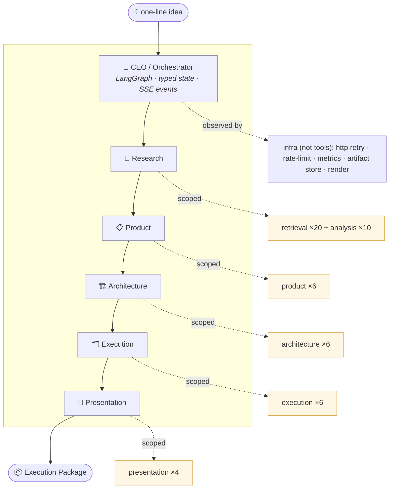
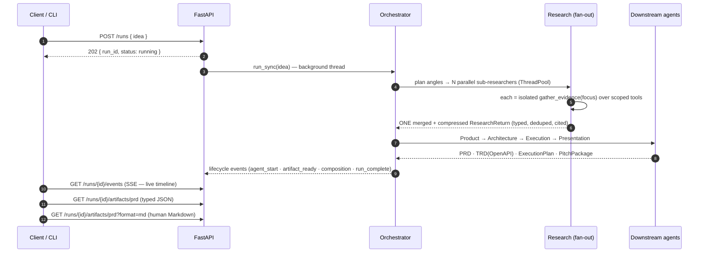
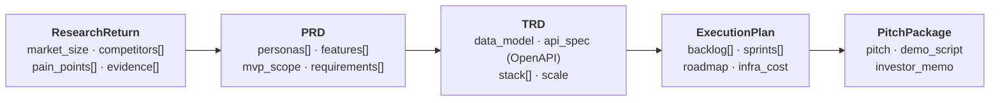
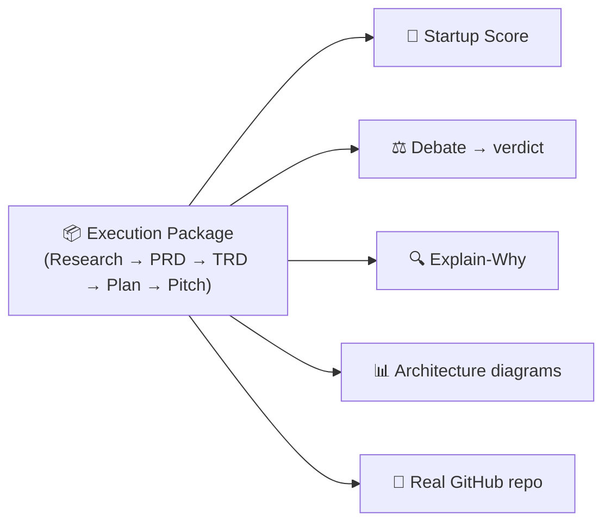

<div align="center">

# 🏢 Autonomous Product Studio (APS)

**One line in. A founder-grade, evidence-grounded startup package out.**

*An organization of AI subagents — CEO → Research → Product → Architecture → Execution → Presentation — that turns* `"Build an AI SaaS for resume screening"` *into market research, a cited PRD, a real OpenAPI spec, a sprint plan, and an investor pitch. The output is **not code** — it's the execution package a founder would pay an agency for.*


</div>

---

## The one-minute pitch

Most "agent" demos fake tool diversity with a row of near-identical LLM wrappers. APS doesn't. The model **genuinely chooses** between 20+ *distinct live sources* — GitHub issues, Hacker News, Reddit, Stack Exchange, arXiv, package registries, Google Trends — to gather **real, clickable evidence**, then a chain of specialist subagents composes that evidence into a typed, schema-valid execution package. Every claim traces back to a source. Every run streams live. It reproduces on free tiers with your own keys.

And it doesn't stop at documents: APS **scores** the idea (0–10, grounded), **debates itself** to a Build/Pivot/Don't verdict, **explains every feature** back to its evidence, and **creates a real GitHub repo** with issues and milestones. It's an autonomous studio that *reasons and acts* — see [**Beyond documents**](#beyond-documents--it-reasons-and-acts) below.

```
                       "Build an AI SaaS for resume screening"
                                        │
                                        ▼
                          ┌──────────────────────────┐
                          │   CEO / Orchestrator      │   LangGraph · holds typed state only
                          └──────────────────────────┘
                                        │
   ┌──────────────┬──────────────┬──────┴───────┬──────────────┬──────────────┐
   ▼              ▼              ▼              ▼              ▼              
Research  →   Product   →  Architecture  →  Execution   →  Presentation
fan-out:3     personas      data model       backlog         pitch
sub-research  features      OpenAPI 3.0      sprints         demo script
20+10 tools   MVP scope     tech stack       roadmap         investor memo
(cited brief) (cited PRD)   (TRD)            infra cost      judge brief
   │
   └─ each subagent: isolated context · its own scoped tools · returns ONE typed Pydantic object
```

---

## How it's wired (architecture)



> **Per-agent scoping is the trick** that keeps a 50-tool registry coherent: globally there are 52 model-callable tools, but no single agent's model ever sees more than ~20 (ADR-0005). Selection is real function-calling, never an `if intent == …` dispatch table.

---

## What a run actually does



A single run is naturally **25–35+ tool calls** (the research fan-out alone fires 3 sub-researchers) — the long-horizon proof, with only compact summaries ever entering the model's context.

---

## The composition chain (typed handoffs, Req 5)

Each arrow is a **typed Pydantic object**, not a re-prompt. The orchestrator holds only these structured returns — that *is* the context-management strategy.



`Research.pain_points → Product.prioritize_features → PRD.requirements → Architecture.design_api_contract → TRD → Execution.generate_backlog → sprints` — and a **`composition` event** is emitted on the Research→PRD handoff so you can *see* the data flow in the live stream.

---

## Beyond documents — it reasons and acts

The execution package is the foundation, not the finish line. On top of every run, APS adds a
**reasoning + action layer** — each a derived, deterministic, on-demand view (so the JSON-native
pipeline, the frozen contract, and the 52-tool count are all untouched):

| Capability | What it does | Endpoint |
|---|---|---|
| 🎯 **Startup Score** | grades the idea **0–10** across Market Opportunity · Competitive Whitespace · Technical Feasibility · Monetization · Founder Velocity — each with an evidence-grounded rationale | `GET /runs/{id}/score[?format=md]` |
| ⚖️ **Autonomous Debate** | a **Risk agent** argues *against* building from the same evidence; a synthesizer returns a **Build / Pivot / Don't** verdict + confidence | `GET /runs/{id}/debate[?format=md]` |
| 🔍 **Explain-Why** | for every feature: the pain/competitor it came from, the **evidence that grounds it**, and a confidence score | `GET /runs/{id}/explain[?format=md]` |
| 📊 **Architecture diagrams** | the TRD → live **Mermaid** system flowchart + ER diagram | `GET /runs/{id}/artifacts/trd?format=mermaid` |
| 🚀 **GitHub Launch Mode** | turns the plan into a **real GitHub repo** — README, milestones, and issues — via the live API (preview-safe without a token) | `POST /runs/{id}/launch/github` |



> *"It doesn't just build — it has an opinion, with reasons, and it ships a real repo."*

---

## The 52-tool registry

| Namespace | Count | What the model can do | Scoped to |
|---|---:|---|---|
| **retrieval** | 20 | hit 20 *distinct* live sources (web · GitHub ×4 · HN ×2 · Reddit ×3 · StackExchange · ProductHunt · Trends · arXiv · Wikipedia · PyPI · npm · jobs · pricing · fetch) | Research |
| **analysis** | 10 | mine pains · cluster themes · sentiment · competitor matrix · market size · rank opportunities · trend signal · validate/dedupe evidence | Research (in compression) |
| **product** | 6 | personas · user stories · prioritize features · MVP scope · acceptance criteria · assemble PRD | Product |
| **architecture** | 6 | data model · **OpenAPI 3.0 contract** · tech stack · scale · components · assemble TRD | Architecture |
| **execution** | 6 | repo plan · backlog · effort · sprints · roadmap · infra cost | Execution |
| **presentation** | 4 | pitch outline · demo script · investor memo · judge brief | Presentation |
| **= 52** | | | |

> **Infra is deliberately *not* counted** as tools — `http`/`retry`/`metrics`/`rate_limiter`/`artifact_store`/`render`/`logging` are platform capability. Reclassifying them out of the count (instead of inflating to 59) is itself the judgment Req-1 tests.

---

## Requirements scorecard

| # | Requirement | How APS meets it |
|---|---|---|
| **1** | 50+ model-driven tools | 52 tools across 6 namespaces; ~30 hit genuinely different live sources → the model *chooses*. Per-agent scoping keeps selection coherent. |
| **2** | Subagent orchestration | 5 specialists, each isolated context + scoped tools, each returning one typed object the CEO holds. |
| **3** | Long-horizon + context mgmt | 25–35+ tool calls/run; the loop holds structured Evidence, the model sees only compact summaries. |
| **4** | Production scaffolding | LangGraph · FastAPI + SSE · Pydantic · Structlog · Tenacity · Prometheus · Pytest · file artifact store · LLM rate-limit. |
| **5** | Real composition | Typed handoffs `Research → PRD → TRD → Execution → Pitch`; a `composition` event makes it visible. |

---

## Quickstart

```bash
# 1. Environment
python -m venv .venv && source .venv/bin/activate
pip install -e ".[dev]"            # or: pip install -r requirements.txt

# 2. (optional) keys — runs fully without them, better with them
cp .env.example .env               # GEMINI_API_KEY or NVIDIA_API_KEY, + APS_GITHUB_PAT, TAVILY_API_KEY …

# 3. Run the full studio from the CLI
python -m aps.orchestrator.run "Build an AI SaaS for resume screening"
python scripts/demo_run.py "a privacy-first habit tracker"   # drops JSON + Markdown per artifact

# 4. Run the API (the frontend's backend)
uvicorn aps.api.main:app --reload
#   POST /runs · GET /runs/{id} · GET /runs/{id}/events (SSE)
#   GET /runs/{id}/artifacts/{name}[?format=md] · GET /metrics

# 5. Tests (offline, hermetic — no keys, no network)
pytest            # 319 passing, 1 live test skipped without a key
```

---

## Keys → what they unlock

Every token-gated tool runs **live with its key** and otherwise returns `[fixture]`-stamped sample data (and logs `tool_fixture_fallback`) — so a reviewer can always run it, and can always tell live data from fixture. With **zero keys**, research still produces a genuine (simpler) brief via the no-key tools; only a fully empty result marks the run `DEGRADED`.

| Env var / install | Unlocks | Without it |
|---|---|---|
| `GEMINI_API_KEY` (or `GOOGLE_API_KEY`) | Gemini tool-selecting research (default provider) | keyless deterministic research, else stub (`DEGRADED`) |
| `NVIDIA_API_KEY` + `APS_MODEL_PROVIDER=nim` | NIM provider path | — |
| `APS_GITHUB_PAT` | live GitHub issues / repos / code search | `[fixture]` |
| `TAVILY_API_KEY` | live `web_search` | `[fixture]` |
| `REDDIT_CLIENT_ID` + `REDDIT_CLIENT_SECRET` | OAuth Reddit (compliant quota) | public JSON (429-prone) → `[fixture]` |
| `pip install -e ".[trends]"` (pytrends) | live Google Trends in `trends_interest` | `[fixture]` |
| no keys / no install | HN · StackExchange · Wikipedia · arXiv · jobs (no-key tools) | genuine keyless brief |

---

## Multi-provider failover (never rely on one API)

Free LLM tiers rate-limit hard (Gemini is 15 RPM) and a single key can 429 mid-demo. So APS
can run over a **priority chain of providers** with **automatic failover** — set
`APS_PROVIDER_CHAIN` and the keys you have:

```bash
APS_PROVIDER_CHAIN="groq,cerebras,gemini,nim,openrouter"   # try in order, fail over on 429/5xx/timeout/auth
```

- **18 providers** supported by just setting a key (Gemini · NVIDIA NIM · Groq · Cerebras ·
  SambaNova · Mistral · OpenRouter · GitHub Models · DeepSeek · Together · xAI · OpenAI ·
  Anthropic) — most are OpenAI-compatible, so it's one client + a base URL.
- **Self-hosted / local** models too — Ollama, LM Studio, vLLM, LocalAI, llama.cpp: start the
  server, set `APS_ENABLE_<NAME>=true` (+ optional `APS_<NAME>_BASE_URL`/`_MODEL`), and add it
  to the chain (e.g. `APS_PROVIDER_CHAIN=vllm,gemini,groq`) — run fully offline with a cloud
  failover behind it.
- **Parallel diversification:** the research fan-out runs each sub-researcher on a *different*
  provider → combine free quotas, ~3× throughput, and any single 429 is covered by that
  unit's own failover chain.
- **Per-provider rate limits**, **key rotation** (`GROQ_API_KEY_2`…), all **deterministic**.
- **Smart & resilient:** a **capability router** orders providers best-fit-first per task
  (tool-tasks never get a no-tool model; load-spread by quota headroom), a **circuit breaker**
  benches a 429'd provider for a cooldown so the chain routes around it, **portable context**
  lets a provider switch mid-loop without losing the message history, and `/metrics` exposes
  `aps_llm_calls_total{provider}` + `aps_llm_failover_total{provider}`.
- Verify your keys: `python scripts/live_providers_smoke.py "<idea>"` prints a provider ×
  tool-calling matrix. Full design: [`multipleAPIplan.md`](multipleAPIplan.md).
- **Back-compat:** unset `APS_PROVIDER_CHAIN` → the original single `gemini`/`nim` path,
  unchanged.

---

## Output: JSON-native, human-readable on demand

The pipeline is **JSON-native and JSON-only-persisted**. Any artifact flips to a polished Markdown document — persona tables, cited requirements, an endpoint table + the full OpenAPI — via a pure, request-time render. Nothing in the pipeline changes; the renderer is infra, not a tool.

```
GET /runs/{id}/artifacts/prd              → typed JSON   (default — machines & frontend)
GET /runs/{id}/artifacts/prd?format=md    → text/markdown (humans & download)
```

---

## Honest run states (no run ever lies)

| State | When | Meaning |
|---|---|---|
| `complete` | valid key → real LLM tool-selecting research, **or** no key → deterministic keyless research over no-key tools | real, idea-specific, grounded evidence |
| `degraded` | every live/keyless path returned nothing | ran end-to-end on the **labeled stub** fixture — never reported as `complete` |
| `failed` | a key is present but **invalid** (preflight 401) | fail fast, don't silently degrade |

A fixture-backed run is **never** reported `complete`; fixture evidence is `[fixture]`-stamped and dropped from real briefs. This honesty is the point.

---

## Status (2026-06-11)

Full pipeline wired — **52 tools, all 6 agents, real LangGraph orchestrator, FastAPI backend with SSE + on-demand Markdown**, **plus the reasoning/action layer** (Startup Score · Autonomous Debate · Explain-Why · Architecture diagrams · real GitHub Launch). **319 tests green** (offline/hermetic; 1 live test skipped without a key), whole tree `ruff`-clean. The live research tool-loop is verified against a real model (NIM nemotron); research **fan-out** (parallel sub-researchers → one merged brief) is live; Gemini's default path is schema-guarded (binds retrieval-only) with a key-gated live test. Eval scored live on `g01` (e2e ✅, schema-valid PRD ✅, coverage 1.0); the 8-idea gold set runs offline in CI. A coherent demo run is committed at `docs/demo_state.json`.

**Output stays credible on noisy ideas:** a deterministic noise filter keeps page-chrome ("Log in · Get Started · Book a Demo"), greetings, and issue-template scaffolding out of the pains/features, and a denylist stops directories/social (LinkedIn, G2, Crozdesk) from posing as competitors — so the headline feature is a real pain, not a navbar.

**Every backend differentiator is done.** Only the **React `frontend/`** remains (the deliberately-deferred area) — and the backend already exposes everything it needs: SSE events, persisted run state, and the `/score` · `/debate` · `/explain` · `/launch` · `?format=mermaid` endpoints. Full hand-off: [`HANDOFF.md`](HANDOFF.md); win-roadmap: [`remaining.md`](remaining.md).

---

## Repo map

| Path | What lives here |
|---|---|
| `src/aps/state/` | Typed Pydantic state — **the frozen contract everyone codes against** |
| `src/aps/orchestrator/` | CEO LangGraph, nodes, EventBus, run entrypoint |
| `src/aps/agents/research/` | Research Agent: tool-loop · fan-out supervisor · keyless path · compression |
| `src/aps/agents/{product,architecture,execution,presentation}/` | the four downstream agents |
| `src/aps/tools/{retrieval,analysis,product,architecture,execution,presentation}/` | the 52 tools + auto-discovery `registry.py` |
| `src/aps/render/` | typed artifact → Markdown + Mermaid (infra, on-demand) |
| `src/aps/scoring/` · `debate/` · `explain/` · `launch/` | the reasoning/action layer (Startup Score · Debate · Explain-Why · real GitHub Launch) — derived, not tools |
| `src/aps/infra/` | http · retry · metrics · rate_limiter · llm rate-limit · artifact_store · logging |
| `src/aps/api/` | FastAPI surface (runs · SSE · artifacts · `?format=md\|mermaid` · `/score` · `/debate` · `/explain` · `/launch` · `/metrics`) |
| `tests/` | 319 unit + integration + eval tests; gold set + scorers |
| `docs/` | PRD · TRD · HLD · ADRs · EVALUATION · API_CONTRACT · MEMO · plan · PRODUCTION_PLAN |
| `frontend/` | React UI (deferred) |

**Read next:** [`docs/MEMO.md`](docs/MEMO.md) (what's deep vs thin, and the decisions defended) · [`docs/PRODUCTION_PLAN.md`](docs/PRODUCTION_PLAN.md) (the path to a deployable product) · [`docs/TEAM_GUIDE.md`](docs/TEAM_GUIDE.md).

> *One finished vertical beats ten agents at 40%.*
